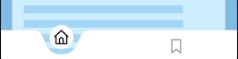
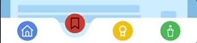
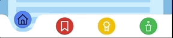

# Fluid Navigation Bar

  
>Many thanks to gskinner for ["The vignettes" showcase](https://flutter.gskinner.com/) presented at Flutter Interact '19 :
They created an awesome creative experience and most of the code in this package comes from
their realisation. I was really impressed by their huge work but the code, even if it was open-sourced,
was not usable as it. So I did some refactoring for maintainability, I extracted some
fields to be able to adapt and skin the widget according to our design and decided to share it.
>
>Enjoy

## Basic Usage

`FluidNavBar` is simply a bottom navigation bar but with a very cool and fluid effect while
animating the transition between an active button to another one.

The example below shows you the minimal code to use the widget.

```dart
@override
  Widget build(context) {
    return MaterialApp(
      home: Scaffold(
        backgroundColor: Color(0xFF75B7E1),
        extendBody: true,
        body: _theBody,
        bottomNavigationBar: FluidNavBar(                     // (1)
          icons: [                                            // (2)
            FluidNavBarIcon(svgPath: "assets/home.svg"),      // (3)
            FluidNavBarIcon(svgPath: "assets/bookmark.svg"),
          ],
          onChange: _handleNavigationChange,                  // (4)
        ),
      ),
    );
  }
```
(1) Create an instance of `FluidNavBar`  
(2) Set the icons, of type `FluidNavBarIcon`, to display in the navigation bar  
(3) `FluidNavBarIcon` supports SVG asset or `IconData`  
(4) Set the callback to react when the user tap an icon (the callback parameter contains the icon's index)   



When defining `FluidNavBarIcon` you can provide an SVG asset or an `IconData`. Use the field `svgPath` for an SVG or 
the field `icon` for an `IconData`.  

Example: 
```dart
FluidNavBar(
          icons: [
            FluidNavBarIcon(
                svgPath: "assets/home.svg",
                backgroundColor: Color(0xFF4285F4),
                extras: {"label": "home"}),
            FluidNavBarIcon(
                icon: Icons.bookmark_border,
                backgroundColor: Color(0xFFEC4134),
                extras: {"label": "bookmark"}),
          ],
``` 

**Note:** For backward compatibility (previous to v1.2.0) you can still use the field `iconPath` to set
the SVG asset to use (this is the same behaviour of `svgPath`). But this field has been deprecated and will
be removed in a future version.

## How To Style

`FluidNavBar` comes with a default set of styles which are directly inherited from the gskinner showcase.
You can override different properties to adapt the fluid navigation bar to your current design:


  - the bar background color (`Colors.white` by default)  
  - the icon background color (the same color as the bar background color by default)  
  - the icon foreground color when it's selected (`Colors.black` by default)
  - the icon foreground color when it's unselected (`Colors.grey` by default)
  
### Global Styles

The easiest way is to define one or more properties in a `FluidNavBatStyle` and set this instance 
in the `style` property of the `FluidNavBar`:

```dart
FluidNavBar(
  icons: [
    FluidNavBarIcon(svgPath: "assets/home.svg"),
    FluidNavBarIcon(svgPath: "assets/bookmark.svg"),
  ],
  onChange: _handleNavigationChange,
  style: FluidNavBarStyle(
    barBackgroundColor: Color(0xFFFB5C66),
    iconBackgroundColor: Colors.white,
    iconSelectedForegroundColor: Color(0xFFFB5C66),
    iconUnselectedForegroundColor: Colors.black
  ),
)
``` 

is displayed as:


Properties:  

| Property | Description |  
|-------|------|  
| `barBackgroundColor` | Set the background color of the bar |  
| `iconBackgroundColor` | Set the background color for all icons |  
| `iconSelectedForegroundColor` | Set the foreground color for the selected icon |  
| `iconUnselectedForegroundColor` | Set the background color for all unselected icons |  

### Local Styles

You can also define some specific styles per icon, by using optional parameters of `FluidNavBarIcon`:  

```dart
FluidNavBar(
  icons: [
    FluidNavBarIcon(svgPath: "assets/home.svg", backgroundColor: Color(0xFF4285F4)),
    FluidNavBarIcon(svgPath: "assets/bookmark.svg", backgroundColor: Color(0xFFEC4134)),
    FluidNavBarIcon(svgPath: "assets/partner.svg", backgroundColor: Color(0xFFFCBA02)),
    FluidNavBarIcon(svgPath: "assets/conference.svg", backgroundColor: Color(0xFF34A950)),
  ],
  onChange: _handleNavigationChange,
  style: FluidNavBarStyle(
    iconUnselectedForegroundColor: Colors.white
  )
),
```

is displayed as

  
_Note: In this example I used also a global style for the foreground color of unselected icons, as I don't want
to set the same color for all icons_

Properties:  

| Property | Description |  
|-------|------|  
| `backgroundColor` | Set the background color of the icon |  
| `selectedForegroundColor` | Set the foreground color for a selected icon |  
| `unselectedForegroundColor` | Set the foreground color for all unselected icons |  

### Styles Priorities

You can define global styles, local styles, both or no style at all!  

To define the proper style to apply it tries, for each style, to resolve its value in the following order:  
  1- local style  
  2- global style  
  3- default value  
when a value is resolved then it applies it to the widget.  

For example if you set the global style `iconBackgroundColor` to `Colors.red` and you also
set the local style `backgroundColor` to `Colors.green` for an icon, then it will use the green color
as the local style will be resolved before the global one.


## Other options

There are also few options, you can play with. They are global options and accessible throw `FluidNaBar` fields.

| Property | Description |  
|-------|------|  
| `animationFactor` | Set the factor to boost or slowdown animation. The default value is 1.0. If you use a value < 1 then the animation will be faster, if you use a value > 1 the animation will be slower |  
| `scaleFactor` | Define the factor used by the animation to zoom the selected icon. The default value is 1.2. If the value is > 1 then it is a zoom-in, if you use a value < 1 then it is zoom-out |  
| `defaultIndex` | Set to change selected item on start of the application. By default set to 0. |  


For an `animationFactor` of 2.0 (slower) and a `scaleFactor` of 2.0 (a zoom-in bigger than the default one), the result is:  



## Contributions

Feel free to create an issue if you find a bug or if you need new features. Of course PRs are welcome!  

If you want to contact me on Twitter: @etaix

### Contributors

Many thanks to these contributors:  
  - Umair M
  - Dmitriy Govorov
  - Christos Tsortanidis  
  - Dorbmon